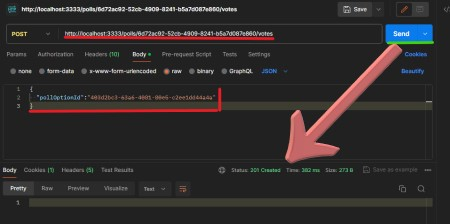

# Polls

Este projeto foi criado drurante a [Rocketseat](https://www.rocketseat.com.br/) Next Level Week, o evento NLW Expert. Com este projeto conseguimos criar enquetes e votar nelas. Estas enquentes são salvadas em um Bando de Dado SQLite, a inserção no DB é feita usando a aplicação Prisma ORM.
Além de que, a API possui uma conexão Websocket onde cada vez que um usuário vota na enquete, a API envia uma mensagem nesta conexão incluindo as atualizações sobre a votação de uma única enquete. A classificação dos votos nas pesquisas é gerenciada com redis.

# Getting Started

## Versão:

Node v20.11.0

## Instalando:

```bash
npm install
```

## Configurando o Upstash + Redis:

1. É necessário criar uma conta no site: [Upstash: Serverless Data Platform](https://upstash.com/)
2. No menu ao topo da página, selecione `Redis` e clique em “Create Database”.
    Coloque o nome de sua preferência, mantenha a opção Regional selecionada e no select abaixo escolha us-east-1.
3. Ao criar sua Database, acesse ela e terá uma página parecida com essa:
    
    Clique no botão informado e copie toda a URL de conexão.
4. De volta ao seu projeto, no arquivo `.env`, mude a variável no `REDIS_URL="URL_AQUI"`.

## Rodando o migrations:

Isso irá rodar todas as migrations criando as tabelas e outras configurações dentro do BD.
```bash
npx prisma migrate dev
```

## Testando a aplicação:

```bash
npm run dev
```
Pode testar a API com uma ferramenta para desenvolvedores e equipes de desenvolvimento de software para testar como : `Postman`, `Insomnia`, `Hoppscotch`.

A API irá rodar em `http://localhost:3333` e a websocket em `ws://localhost:3333`.

## Rotas:

| Rotas                  | Métodos| Protocolo| Descrição                                     |
| ---------------------- | ------ | -------- | ----------------------------------------------|
| /polls                 | POST   | HTTP     | Cria uma nova enquete.                        |
| /polls/:pollId         | GET    | HTTP     | Busa uma enquente especifica.                 |
| /polls/:pollId/vote    | POST   | HTTP     | Vota em uma opção da enquete.                 |
| /polls/:pollId/results | --     | WS       | Abre uma WS conexão que recebe o resultado dos votos.|

### Funcionamento:
Abra a ferramenta de auxilio escolhida:
1. Insira dados em vermelho :

2. Para buscar as opções da enquete criada, insira os dados em vermelho, e não esqueça que cada enquete terá um código, assim basta colocar o cógido gerado pela sua enquete:

3. Antes de votar podemos verificar a conexão Websocket, basta muda o tipo de requisição de `http` para `websocket`, inserir a url e Conectar, aqui podemos acompanhar todas movimentação dos votos:


4. Por fim, é hora de votar, insira a url e o código da opções escolhida e enviar:
